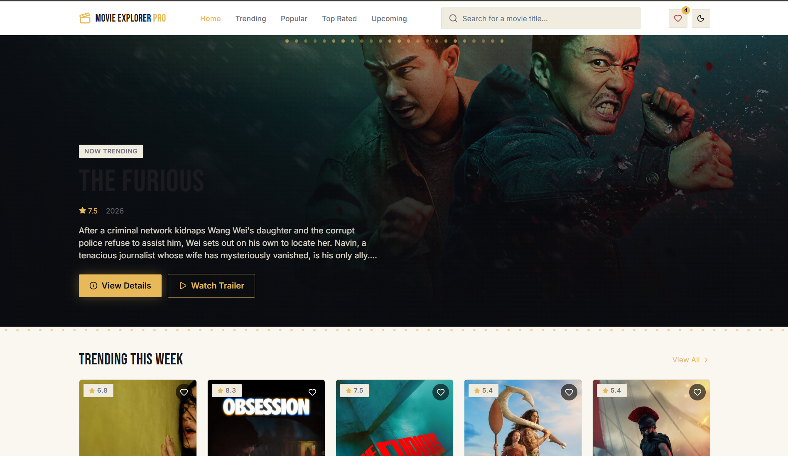
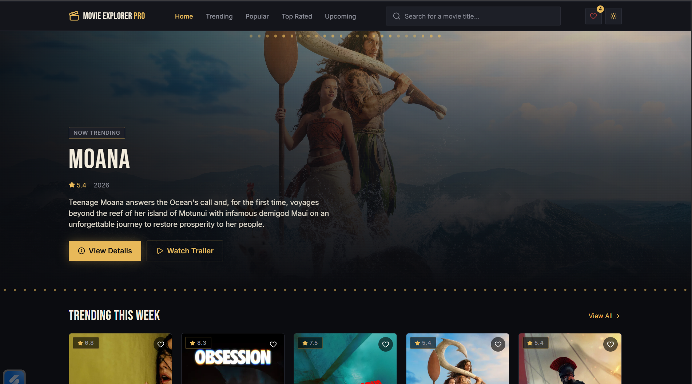
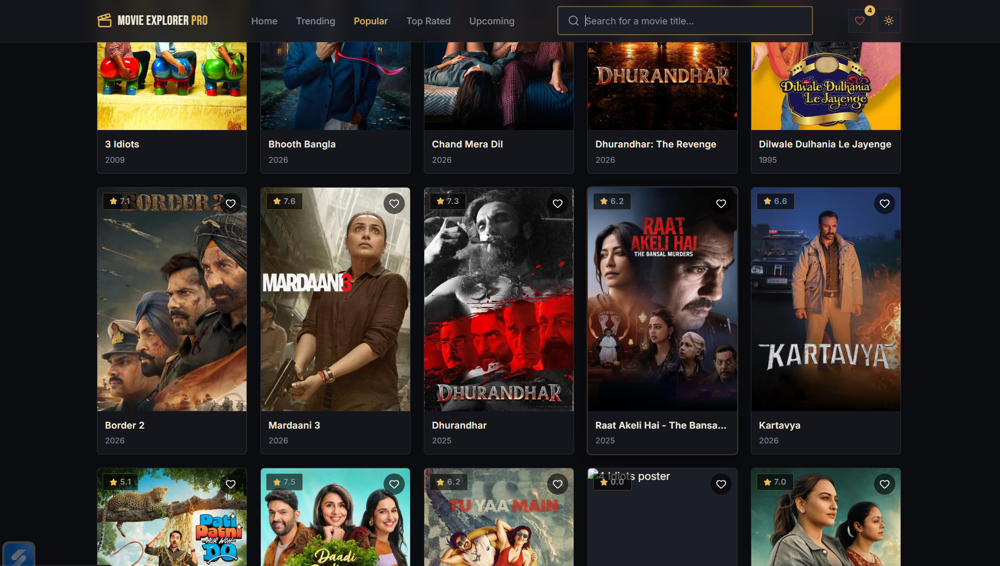

<p align="center">
  
</p>

<h1 align="center">🎬 Movie Explorer Pro</h1>

<p align="center">
A modern movie discovery platform built with <b>React</b> that allows users to search, explore, and discover trending movies with a clean, responsive, and intuitive interface powered by the <b>TMDB API</b>.
</p>

<p align="center">

<a href="YOUR_LIVE_DEMO_LINK">

</a>

<a href="YOUR_GITHUB_REPO_LINK">

</a>

</p>

<p align="center">


</p>

---

# 📖 About The Project

Movie Explorer Pro is a modern movie discovery web application that enables users to explore trending movies, search for their favorite titles, and access detailed movie information in real time.

Powered by the **TMDB API**, the application provides movie posters, ratings, release dates, genres, and descriptions through a fast and responsive interface. Built with **React** and **Tailwind CSS**, the project focuses on performance, clean UI, and seamless user experience.

---

# ✨ Features

- 🎬 Browse Trending Movies
- 🔍 Search Movies Instantly
- ⭐ View Ratings & Popularity
- 📅 Release Dates
- 📖 Movie Overview & Details
- 🎭 Genre Information
- 🖼 High-Quality Movie Posters
- ⚡ Fast API Integration
- 📱 Fully Responsive Design
- 🎨 Modern & Clean UI

---

# 📸 Screenshots

<div align="center">

### 🏠 Home Page



<br><br>

### 🔍 Search Movies


<br><br>

### 🎬 Movie Details



</div>

---

# 🛠 Tech Stack

| Category | Technologies |
|-----------|--------------|
| ⚛️ Frontend | React.js, Vite |
| 🎨 Styling | Tailwind CSS |
| 🌐 API |  REST API |
| 💻 Language | JavaScript (ES6+) |
| 🔧 Tools | Git, GitHub |
| 📱 Design | Responsive UI |

---

# 📂 Project Structure

```bash
Movie-Explorer-Pro
│
├── public
├── screenshots
│
├── src
│   ├── assets
│   ├── components
│   ├── pages
│   ├── services
│   ├── App.jsx
│   └── main.jsx
│
├── .env
├── package.json
├── vite.config.js
└── README.md
```

---

# ⚙️ Installation

### Clone the Repository

```bash
git clone https://github.com/meenuparashar18/movie-explorer-pro.git
```

### Navigate to the Project

```bash
cd Movie-Explorer-Pro
```

### Install Dependencies

```bash
npm install
```

### Configure Environment Variables

Create a `.env` file and add your TMDB API key.

```env
VITE_TMDB_API_KEY=YOUR_API_KEY
```

### Run the Development Server

```bash
npm run dev
```

---

# 🌐 API Used

The application uses the **TMDB API** to fetch:

- 🎬 Trending Movies
- 🔍 Search Results
- ⭐ Ratings
- 🎭 Genres
- 📅 Release Dates
- 📖 Movie Details

---

# 💡 What I Learned

Through this project, I strengthened my understanding of:

- React Components
- React Hooks
- API Integration
- Fetch API
- Async JavaScript
- Environment Variables
- Responsive UI Development
- Project Structure
- Git & GitHub Workflow

---

<p align="center">
⭐ If you like this project, don't forget to star the repository!
</p>

